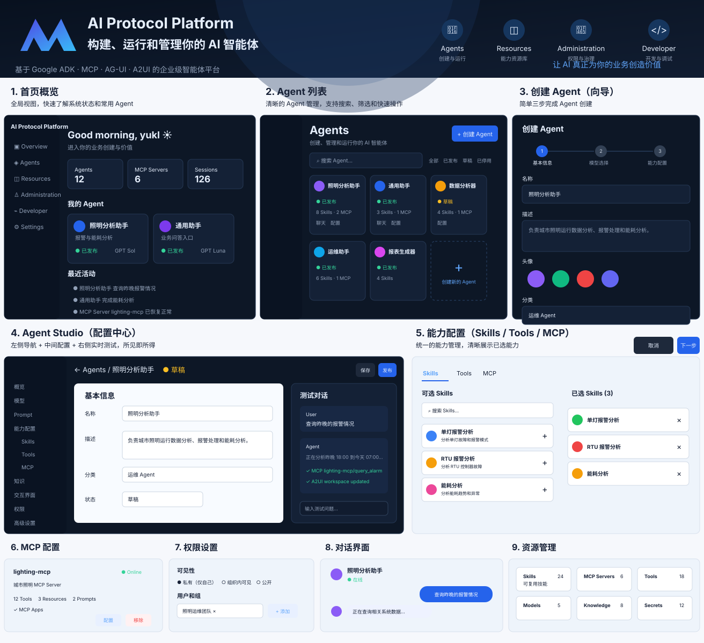

# AI Protocol Platform — 产品重设计方案

> 状态：Proposal  
> Target：v1.1 — Platform Productization  
> Parent Epic：#74
> 日期：2026-09-20

> **架构纠偏（2026-09-20）：** 本文早期版本的多 Agent / Agent List / Agent
> Switcher 方案已废止。平台本身就是一个 Agent；Skill 是该 Agent 的能力，
> 不是默认独立对外暴露的 Agent。后续实现以 Issue #74 的
> **Single Root Agent + Skills / Tools / MCP / Knowledge** 为准。



## 1. 重设计目标

当前平台已经具备 Model Provider、Skill、Native Tools、MCP/MCP Apps、AG-UI、A2UI、Tenant、Tool Permission、Session/Memory 等底层能力，但产品层仍以历史 Skill Studio / Admin 页面为中心组织，导致用户必须理解内部数据结构才能完成 Agent 配置。

本方案不继续在旧页面上叠加字段，而是把产品重新定义为三层：

```text
Agents
负责：创建、配置、测试、发布真正面向用户的 Agent

Resources
负责：给 Agent 提供能力
Skills / Tools / MCP / Models / Knowledge / Secrets

Administration
负责：治理
Tenant / User / Group / Permission / Usage / Audit
```

Developer 能力单独收口，用于 Playground、A2UI、MCP Apps、协议调试和 Demo，不再污染主用户路径。

## 2. 产品模型

平台只有一个用户面对的 Root Agent：

```text
AI Protocol Platform
        │
        ▼
   Single Root Agent
        ├── Model / Prompt / Session
        ├── Skills
        ├── Native Tools
        ├── MCP Servers
        ├── Knowledge
        ├── A2UI / Interaction
        └── Specialist Agents（高级、可选）
```

Skill 只描述专业能力：instructions、requiredTools、requiredMcpTools、
references、examples 和 accessControl。普通 Skill 不再拥有独立 Chat、Session、
Model、Persona、Voice 或 A2UI 页面；确实需要独立模型、Prompt 和推理策略的能力
才建模为 Specialist Agent。

现有 `SkillConfig → create_agent(skill_config)` 作为兼容路径保留，新的
`AgentConfig` 先以兼容层持久化，逐步迁移 runtime composition。

## 3. 一级信息架构

```text
Overview

Agent
  Overview / Model / Prompt / Skills / Tools / MCP / Knowledge / Interaction / Permissions / Advanced

Resources
  Skills
  Tools
  MCP Servers
  Models
  Knowledge
  Secrets

Administration
  Tenants
  Users & Groups
  Permissions
  Usage
  Audit

Developer
  Playground
  A2UI
  MCP Apps
  Protocol Inspector

Settings
```

角色权限决定是否显示 Administration / Developer。

## 4. 核心用户路径

### 4.1 配置 Root Agent

```text
Root Agent Settings
  ↓
Overview / Model / Prompt
  ↓
Capabilities
  ├ Skills
  ├ Tools
  └ MCP
  ↓
Knowledge / Interaction / Permissions / Advanced
```

创建流程只保留最低必要配置，复杂参数进入 Studio 后再补充。

### 4.2 配置 Root Agent

```text
Single Agent Settings

Overview
Model
Prompt
Capabilities
  Skills
  Tools
  MCP
Knowledge
Interaction
Permissions
Advanced
```

右侧固定 Test / Preview，形成“配置即测试”的闭环。

### 4.3 使用 Root Agent

Chat 页面只负责：
- 使用 Root Agent（不展示 SkillSwitcher）
- 新建 / 恢复会话
- 对话
- A2UI / MCP Apps 交互

不再承担 Agent 配置和平台管理职责。

## 5. Single Agent Settings

采用三栏布局：

```text
┌──────────────┬──────────────────────────────┬──────────────────────┐
│ 配置导航      │ 当前配置                     │ Test / Preview       │
│              │                              │                      │
│ Overview     │                              │ User                 │
│ Model        │                              │ 查询昨晚报警          │
│ Prompt       │                              │                      │
│ Capabilities │                              │ Agent                │
│  Skills      │                              │ 正在分析...           │
│  Tools       │                              │                      │
│  MCP         │                              │ MCP query_alarm ✓    │
│ Knowledge    │                              │ A2UI workspace ✓     │
│ Interaction  │                              │                      │
│ Permissions  │                              │ [输入测试问题...]     │
│ Advanced     │                              │                      │
└──────────────┴──────────────────────────────┴──────────────────────┘
```

### 5.1 Model

Provider 与 Model 分开选择；Tier 若保留，只作为 Automatic model selection。

展示模型能力：
- Tool Calling
- Streaming
- Reasoning
- Vision
- Responses API
- Context window / output limit

### 5.2 Prompt

保留结构化输入：
- Goal
- Guidelines
- Constraints
- Output Format
- Additional

增加 Raw / Effective Prompt 高级视图。

### 5.3 Capabilities

统一能力入口：

```text
Capabilities
├── Skills
├── Native Tools
└── MCP
```

用户不需要理解 `subSkills`、`toolConfigs` 等内部字段。

## 6. MCP 交互重构

### Single Agent Settings → MCP

负责“当前 Agent 使用哪些 MCP”：

- 选择已有 MCP Server
- 展示 Online / Offline / Disabled
- 展示 Tools / Resources / Prompts / MCP Apps
- 绑定 / 解绑
- 后续支持 MCP Tool whitelist
- 支持“新建 MCP Server”后返回并直接绑定

### Resources → MCP Servers

只负责 MCP Registry：

- URL
- Transport
- Authentication
- Tenant / Platform scope
- Health
- Discovery
- Tools / Resources / Prompts
- MCP Apps
- Used by Agents

MCP Admin 不再以“选 Skill 再绑定”为主操作。

## 7. A2UI / Interaction

统一放到 Interaction 页面：

- Enable A2UI
- Default Surface：Chat / Workspace / Sidebar / Modal
- Update Mode：Replace / Patch
- Allow Surface Context Writes
- Allow Action Triggered Runs
- Voice
- Welcome
- Starter Prompts

底层继续映射现有 `skillMetadata.toolConfigs.a2ui`，迁移完成后归入 Root Agent 的
`interaction` 配置块。

## 8. Knowledge

产品层统一称为 Knowledge，不再让用户首先看到 Bucket Browser。

入口支持：
- Documents
- Folder
- Knowledge Base
- 后续 Database / External Source

第一阶段继续兼容现有 welcome.bucketBrowser 和 documents API。

## 9. Permissions

权限页面必须展示最终生效结果，而不只是配置源：

```text
Root Agent capability ceiling
∩ Tenant policy
∩ Group policy
∩ User permission
= Effective runtime access
```

展示：
- Visibility
- Tenant / Group / User
- Model effective access
- Tool effective access
- MCP effective access
- Knowledge effective access

## 10. Chat

主聊天页只展示 Root Agent 身份，不展示 SkillSwitcher 或多 Agent 列表。

内部 Skill / Tool / Demo 分流到：
- Resources
- Developer

Chat 页面建议：
- 左侧 Conversations
- 中间 Chat / A2UI
- 顶部 Agent 名称 + New Chat
- 管理入口不与使用入口混杂

## 11. Overview

首页只回答三个问题：

1. 我的 Root Agent 当前有哪些能力？
2. 平台当前是否正常？
3. 最近发生了什么？

主要区块：
- Agent count / active status
- MCP health
- Model Provider health
- Sessions / Usage
- Recent activity
- Quick actions

## 12. Resources

统一管理可复用资源：

```text
Resources
├── Skills
├── Tools
├── MCP Servers
├── Models
├── Knowledge
└── Secrets
```

每个资源都应支持：
- 搜索 / 分类
- 状态
- Used by Agents
- 权限范围
- 快速进入配置

## 13. Developer

将当前 Demo / Workshop / Experimental 能力收口到 Developer：

- Playground
- A2UI Playground
- MCP Apps Playground
- Protocol Inspector
- Demo Skills
- Experimental Skills

普通用户默认不显示。

## 14. 路由规划

```text
/

/agent

/chat/{agentId}

/resources/skills
/resources/tools
/resources/mcp
/resources/models
/resources/knowledge
/resources/secrets

/admin/tenants
/admin/users
/admin/groups
/admin/permissions
/admin/usage
/admin/audit
/admin/settings

/developer
/developer/a2ui
/developer/mcp
/developer/protocols
```

旧 `/skills/studio/*` 保留兼容跳转，第一阶段不破坏现有 API / Runtime。

## 15. UI 视觉原则

### 15.1 风格基准

前端统一采用 **Linear-inspired Enterprise Agent Console** 风格。

参考来源：

- [VoltAgent/awesome-design-md — Linear DESIGN.md](https://github.com/VoltAgent/awesome-design-md/blob/main/design-md/linear.app/DESIGN.md)
- 项目根目录 [DESIGN.md](../../DESIGN.md) 为本项目最终视觉约束

采用 Linear 的核心原因：

- 适合工程师和企业用户的高信息密度后台
- 近黑画布 + 多级中性色 Surface 非常适合 Agent Studio 三栏布局
- 1px Hairline + 极少阴影适合 MCP / 权限 /资源管理
- 单一蓝紫 Accent 能保持科技感但避免“霓虹仪表盘”
- 紧凑控件和清晰层级适合 Model / Tool / MCP / Trace 等技术对象

这不是品牌复刻。禁止复制 Linear Logo、专有字体和品牌资产，只采用其产品 UI 的设计原则并进行平台化适配。

### 15.2 核心视觉约束

- Dark-first，同时提供同语义 Light Theme
- Canvas / Surface-1 / Surface-2 / Surface-3 四级层次
- 主 Accent 使用克制的 Lavender Blue
- Cards / Inputs / Buttons 使用 6–12px 圆角
- 默认 1px Hairline Border，不依赖大阴影
- 默认 UI 字号 14px；页面标题约 24px
- Inter / Geist + 中文系统字体
- Agent 使用卡片；Resources 默认使用 List / Table
- 状态必须使用“颜色 + 文本/图标”
- 科技感来自实时状态、协议链路、Trace 和 Agent Preview，而不是发光边框

明确禁止：

- Glassmorphism
- 大面积渐变
- Neon Glow
- 多个高饱和 Accent
- 全页面超大卡片
- 大量 Pill Button
- Emoji 作为正式导航图标
- 每个页面各自一套视觉规则

具体颜色、Typography、Spacing、Radius、Agent Studio、MCP、Permissions、Chat、Responsive 规范全部以根目录 `DESIGN.md` 为准。

## 16. 实施顺序

### Phase 1 — Root Agent 语义收口
- 单一 Root Agent / AgentConfig 兼容层
- Chat 移除 SkillSwitcher
- Model / Prompt / Session 收口到 Root Agent
- Demo / internal Skill 分流到 Resources / Developer

### Phase 2 — Single Agent Settings 核心闭环
- Settings Shell
- Basic / Model / Prompt
- Skills / Tools
- MCP Binding
- MCP Registry 职责收敛

### Phase 3 — 平台化体验
- Knowledge
- A2UI / Interaction
- Permissions / Effective Access
- Test / Preview

### Phase 4 — 收尾
- Developer Mode
- 旧页面迁移
- Browser E2E
- Legacy UI 清理

## 17. 设计原则总结

> Root Agent 是用户看到的产品；Skill、Tool、MCP、Knowledge 是 Root Agent 使用的资源；Administration 负责治理；Developer 负责实验。

> UI 风格统一遵循 Linear-inspired Enterprise Agent Console：紧凑、精确、克制、暗色优先、单 Accent、高信息密度。

上述两条原则应作为 #74 后续所有 Feature 拆分和 UI 实现的共同约束。
